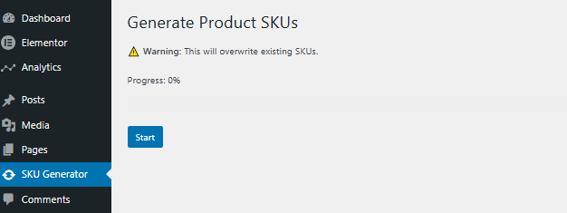

# ⚡ WooCommerce SKU Generator (Bulk AJAX Tool)

A high-performance WooCommerce plugin to generate **unique SKUs in bulk** using AJAX — designed specifically for stores with **hundreds or thousands of products**.

---

## 🚀 Why This Plugin?

Most SKU generator plugins fail or timeout when handling large product catalogs.

This plugin solves that by:
- ✅ Processing products in **batches**
- ⚡ Using **AJAX-based background processing**
- 📊 Showing **real-time progress bar**

---

## ✨ Features

- ⚡ Bulk SKU generation for thousands of products
- 🔄 AJAX-based batch processing (no timeouts)
- 📊 Live progress tracking (visual progress bar)
- 🔢 Generates **unique numeric SKUs**
- 🧠 Lightweight and efficient
- 🛠️ Admin panel interface

---

## 🛠️ Tech Stack

- PHP (WordPress Plugin Development)
- WooCommerce API
- AJAX (Admin)
- JavaScript (Progress UI)

---

## 📸 Screenshots

### Admin Panel

---

## ⚙️ Installation

1. Upload plugin to:
   /wp-content/plugins/woocommerce-sku-generator
2. Activate plugin
3. Go to:
   WordPress Admin → SKU Generator
4. Click **Start** to begin generating SKUs

---

## 🧠 How It Works

- Fetches total number of products
- Processes products in batches (default: 100)
- Generates a unique numeric SKU for each product
- Updates products without overloading the server
- Displays progress in real-time

---

## ⚠️ Important Notes

- ⚠️ This will **overwrite existing SKUs**
- Recommended to **backup your database before use**
- Designed for **performance with large catalogs**

---

## 📦 About SKU Format

- Generates **13-digit numeric SKUs**
- Useful for consistent internal product identification
- ⚠️ These are **not GTIN/EAN barcodes** (for Google Merchant Center)

---

## 💡 Use Cases

- Stores with missing SKUs
- Migrated WooCommerce stores
- Bulk product imports without identifiers
- Performance-safe SKU generation

---

## 🔮 Future Improvements

- Custom SKU length
- Prefix / suffix support (e.g. FS-000123)
- Skip existing SKUs option
- Category-based SKU generation
- Logging system

---

## 👨‍💻 Author

**Muhammad Faisal**  
Full Stack Developer (Laravel & WordPress)

📧 mffaisal877@gmail.com  
🔗 https://linkedin.com/in/muhammad-faisal-a618731b1  

---

## ⭐ Support

If you find this useful, consider giving it a ⭐ on GitHub!
